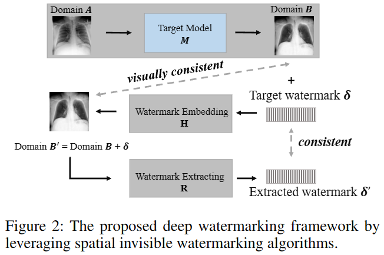
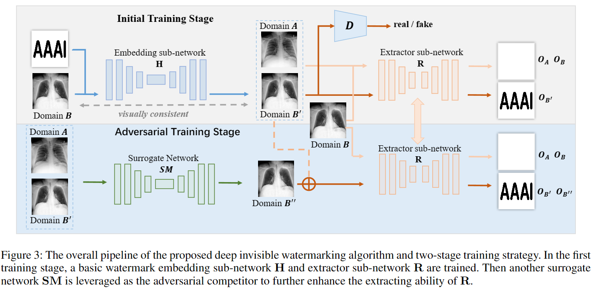
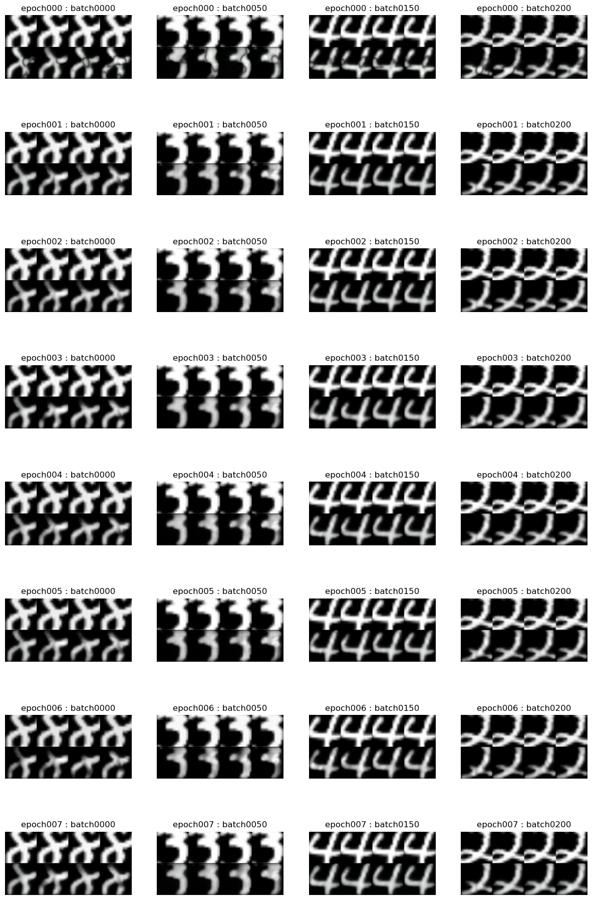

# DeepLearning-Watermarking
Major study : Watermarking test with Deep-Learning process. 

This project leverages the power of deep learning algorithms to embed and extract watermarks from images and videos, ensuring that the watermarks are imperceptible to the human eye while remaining resilient to various attacks. 

- from the paper : "[Model Watermarking for Image Processing Networks" (AAAI 2020)](https://arxiv.org/pdf/2002.11088.pdf)"
- Original Repository : "[ZJZAC/Deep-Model-Watermarking](https://github.com/ZJZAC/Deep-Model-Watermarking)

### If you want to understand how to implement, read below.

Target Model means any model you need, not in here.

IF you dont have Target Model, then just keep in mind you have to same Domain A and B.

## The Test output results is below.
| Mean S-PSNR: 23.5156 | Mean S-SSIM: 0.9386 | Mean R-PSNR: 23.7978 |Mean R-SSIM: 0.9632 |

- I : from Image
- S : Secret Image when train or test process
- R : Direct extracted Secret Image with R-Net

### Crop Center

